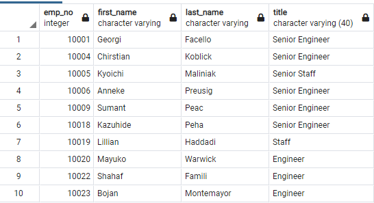

# Pewlett-Hackard-Analysis
## "Silver Tsunami"
---
## Overview  

 Pewlett-Hackard has a large, loyal employee population. Currently Pewlett-Hackard is experiencing a large wave of personnel reaching retirement age. Bobby (P-H analyst) and I were hired to organize employee data. We broke it down into groups of employees retiring by their titles, and which were eligible to become mentors through P-H's mentorship program. 
  

## Results  
- First filtered the data based on employees' birth dates, and found that many employees have help multiple titles throughout their years at the company.   
      
    *Table 1: Titles of employees based on their employee numbers.*   

- We were able to display employees with only their current titles after using DISTINCT ON, which removed the duplicate entries of employee numbers.   
      
    *Table 2: Display of employees' current job titles.*   

- Tables 1 and 2 house wonderful information, but our boss was also interested in the number of employees that would be leaving. We quickly went to work with the COUNT function.   
      
    *Table 3: Compact table displaying the total number of employees due to retire soon per title held within the company.*   

- Finally the mentorship program. Bobby and I found over 1,000 employees that were eligible to mold the next generation of Pewlett-Hackard employees. Table 4 below shows a handful of them.    
      
    *Table 4: Employees eligible for mentorship program broken down by birth date, length of time in their current position, and title they currently hold.*   

## Summary   

In total, Bobby and I discovered that P-H will need to fill over 70,000 positions as the retirement wave progresses. More research should be completed to find out how many of those postitions are in leadership roles within the company. P-H will have to determine if they would like to fill those by hiring within the company's current employee pool, or if they would like to fill them from outside the company. 
 

Of the 70,000 about to retire, only 1,500 or so are ready to mentor those coming in to fill those roles. P-H should look into how many titles fall within which departments, and form mentorship meetings to engage more employees per mentor.

